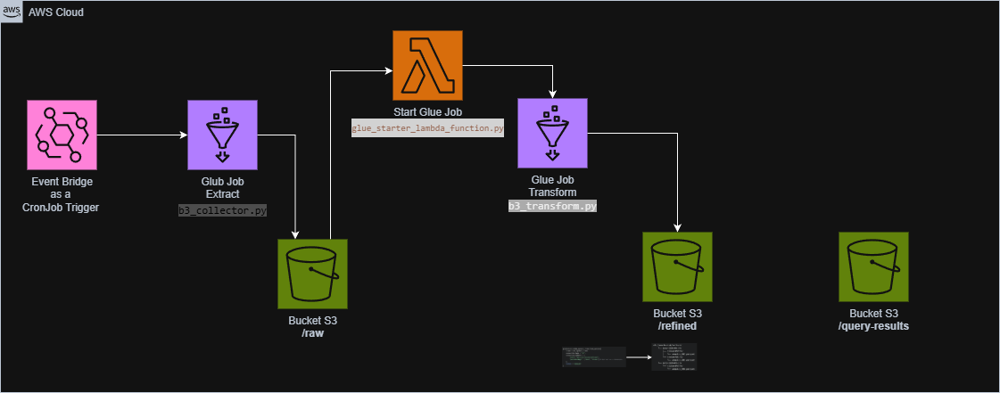

# AWS ETL Fiap

Este projeto implementa um pipeline de ETL (Extração, Transformação e Carga) para dados do mercado financeiro, utilizando serviços da AWS. O objetivo é extrair dados de ações, processá-los e disponibilizá-los para consulta via SQL com o Amazon Athena.

## Requisitos do Pipeline

*   **Requisito 1:** Scrap de dados de ações ou índices da B3 (granularidade diária).
*   **Requisito 2:** Os dados brutos devem ser ingeridos no S3 em formato parquet com partição diária.
*   **Requisito 3:** O bucket deve acionar uma lambda, que por sua vez irá chamar o job de ETL no Glue.
*   **Requisito 4:** A lambda pode ser em qualquer linguagem. Ela apenas deverá iniciar o job Glue.
*   **Requisito 5:** O job Glue deve conter as seguintes transformações obrigatórias:
    *   A: Agrupamento numérico, sumarização, contagem ou soma.
    *   B: Renomear duas colunas existentes.
    *   C: Realizar um cálculo com base na data.
*   **Requisito 6:** Os dados refinados no job Glue devem ser salvos no formato parquet em uma pasta chamada `refined`, particionado por data e pelo nome ou código da ação/índice.
*   **Requisito 7:** O job Glue deve automaticamente catalogar o dado no Glue Catalog e criar uma tabela.
*   **Requisito 8:** Os dados devem estar disponíveis e serem consultados usando SQL através do Athena.

## Arquitetura do Pipeline

 Diagrama de arquitetura

A arquitetura desacoplada utiliza múltiplos serviços da AWS para criar um pipeline robusto e escalável:

1.  **Agendamento (EventBridge):** Um agendamento diário no Amazon EventBridge aciona o primeiro job do AWS Glue, iniciando o pipeline.
2.  **Extração (AWS Glue):** O primeiro job (`b3_collector.py`) é responsável por extrair dados de ações da internet (usando a biblioteca `yfinance`) e salvá-los em formato Parquet no bucket S3, dentro do prefixo `raw/`.
3.  **Gatilho (S3 + Lambda):** A chegada de um novo arquivo em `raw/` aciona uma função AWS Lambda (`glue_starter_lambda_function.py`).
4.  **Orquestração (Lambda):** A função Lambda atua como um orquestrador, iniciando a execução do segundo job do AWS Glue.
5.  **Transformação (AWS Glue):** O segundo job (`b3_transform.py`) lê os dados brutos de `raw/`, aplica as transformações de negócio necessárias e salva os dados enriquecidos no prefixo `refined/`.
6.  **Catálogo de Dados (Glue Catalog):** Ao final do processo, o job de transformação atualiza o AWS Glue Data Catalog, tornando os dados disponíveis para consulta.
7.  **Análise (Amazon Athena):** Os dados finais em `refined/` podem ser consultados diretamente via SQL utilizando o Amazon Athena.

## Tecnologias e Bibliotecas

-   **Terraform:** Utilizado para automação da infraestrutura como código (IaC), permitindo o provisionamento e gerenciamento de todos os recursos da AWS de forma declarativa.
-   **AWS Glue:** Serviço central do pipeline, usado para executar jobs de ETL serverless com PySpark.
-   **AWS Lambda:** Atua como um orquestrador para iniciar o job de transformação do Glue a partir de um gatilho do S3.
-   **Amazon S3:** Utilizado como Data Lake para armazenar os dados brutos (`raw/`), processados (`refined/`) e os scripts da aplicação.
-   **Amazon Athena:** Permite a consulta interativa dos dados refinados no S3 usando SQL padrão.
-   **Amazon EventBridge:** Responsável pelo agendamento diário que inicia o pipeline.
-   **Python:** Linguagem principal para os scripts dos jobs Glue e da função Lambda.
-   **PySpark:** API Python para Spark, utilizada dentro do AWS Glue para manipulação de dados em larga escala.
-   **Pandas:** Usada no script de coleta para facilitar a manipulação inicial dos dados extraídos da API `yfinance`.
-   **Yfinance:** Biblioteca Python para extração de dados do mercado financeiro do Yahoo Finance.
-   **Boto3:** SDK da AWS para Python, utilizado para interagir com os serviços da AWS programaticamente (ex: iniciar o job Glue a partir da Lambda).

### Estrutura do S3

Os dados são organizados no S3 da seguinte maneira:

- `s3://<bucket-name>/raw/`: Armazena os dados brutos extraídos pela primeira etapa do pipeline, particionados por data.
- `s3://<bucket-name>/refined/`: Armazena os dados processados e enriquecidos, prontos para análise, também particionados.
- `s3://<bucket-name>/scripts/`: Armazena os scripts Python e PySpark utilizados pelos jobs do Glue e pela função Lambda.

## Scripts do Projeto

-   `src/b3_collector.py`: Script PySpark para o job de extração do Glue.
-   `src/b3_transform.py`: Script PySpark para o job de transformação do Glue.
-   `src/glue_starter_lambda_function.py`: Script Python para a função Lambda que aciona o job de transformação.

## Infraestrutura como Código (Terraform)

A infraestrutura é definida em módulos do Terraform, localizados no diretório `infra/`. A estrutura modular inclui:

-   `eventbridge/`: Define o agendamento do pipeline.
-   `lambda-glue-starter/`: Define a função Lambda que starta o job de Transformação, que o script está no arquivo b3_transform.py e seu gatilho é a inserção dos dados no S3 pelo Glue Job de Extração(b3_collector.py).
-   `glue/`: Define os dois jobs do Glue, o Data Catalog e as permissões necessárias.
-   `s3/`: Define o bucket S3 para armazenamento dos dados.

## Dependências

As dependências Python do projeto estão listadas no arquivo `requirements.txt`:

- `yfinance`: Para extração de dados do Yahoo Finance.